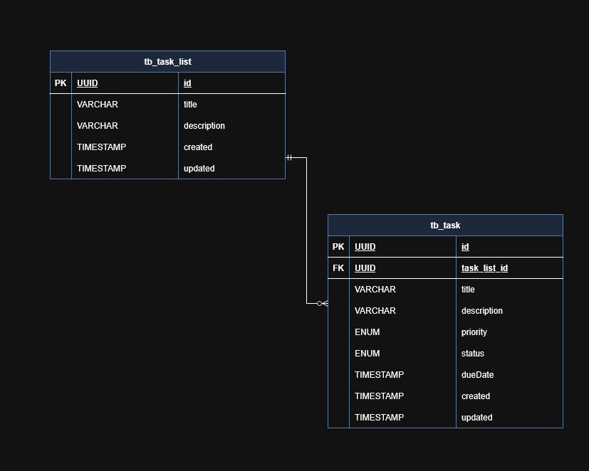
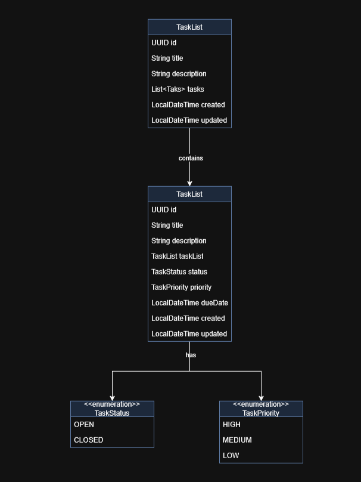
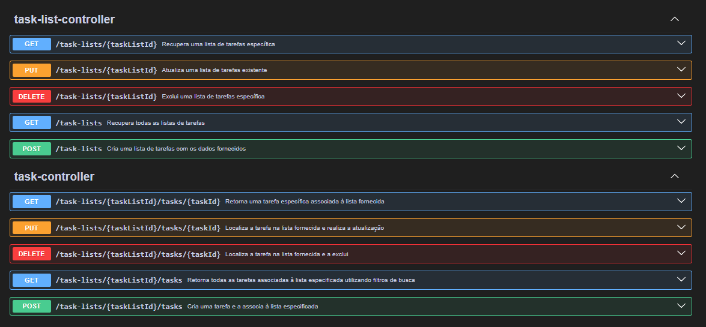

# 📘 Task Tracker - Rest API

## Visão Geral

Este projeto é uma API REST desenvolvida com **Spring Boot** para gerenciar listas de tarefas e suas respectivas tarefas.  
A aplicação permite criar, listar, atualizar e excluir listas de tarefas, bem como adicionar, consultar, modificar e remover tarefas dentro dessas listas.

---

## 📚 Tecnologias Utilizadas

- Java 21
- Spring Boot 3.x
- Spring Data JPA
- Hibernate
- Jakarta Bean Validation
- Lombok
- Swagger/OpenAPI
- Banco de dados relacional (PostgreSQL)
---

## 🧱 Componentes e Arquitetura

## 🔍 Consultas Dinâmicas com Specifications

A aplicação utiliza o recurso de Specifications do Spring Data JPA para construir consultas dinâmicas com base em parâmetros opcionais fornecidos nas requisições:

- **TaskSpecifications**: Classe que fornece métodos estáticos para criar critérios de filtragem, como `hasTaskListId`, `hasStatus`, `hasPriority` e `hasDueDateBeforeOrEqual`.
- **TaskServiceImpl**: Utiliza essas Specifications para construir dinamicamente a consulta de tarefas com base nos parâmetros fornecidos (`status`, `priority`, `dueDate`).

Esse approach permite uma filtragem flexível e eficiente das tarefas, sem a necessidade de escrever múltiplos métodos de consulta no repositório.

---

## ✅ Validação de Dados

A aplicação utiliza anotações de validação do Jakarta Bean Validation (`@Valid`, `@NotNull`, `@Size`, etc.) para garantir a integridade dos dados recebidos nas requisições.  
Essas validações são aplicadas nos DTOs de entrada e são automaticamente processadas pelo Spring Boot, que retorna erros apropriados em caso de violação das restrições.

---

## ⚠️ Tratamento de Erros

A classe `GlobalExceptionHandler` utiliza a anotação `@ControllerAdvice` para capturar e tratar exceções de forma centralizada:

- **MethodArgumentNotValidException**: Captura erros de validação dos DTOs e retorna uma resposta com status `400 Bad Request`, incluindo detalhes dos campos inválidos.
- **IllegalArgumentException**: Captura exceções relacionadas a argumentos ilegais e retorna uma resposta com status, incluindo a mensagem de erro e a descrição da requisição.

Esse tratamento centralizado melhora a consistência e a clareza das respostas de erro da API.

---

### 1. Camada de Entidades (Domain Entities)

As entidades representam os modelos de dados persistidos no banco de dados:

- Diagrama Modelo Entidade Relacional

    

- Diagrama de Classes

    

### 2. Camada de DTOs (Data Transfer Objects)

Os DTOs são utilizados para transferir dados entre o cliente e o servidor:

- **CreateTaskListDto / UpdateTaskListDto**: Utilizados para criar e atualizar listas de tarefas, respectivamente.
- **ResponseTaskListDto**: Utilizado para retornar informações de uma lista de tarefas, incluindo progresso e tarefas associadas.
- **CreateTaskDto / UpdateTaskDto**: Utilizados para criar e atualizar tarefas, respectivamente.
- **ResponseTaskDto**: Utilizado para retornar informações de uma tarefa.

### 3. Camada de Mapeamento (Mappers)

Os mapeadores convertem entre entidades e DTOs:

- **TaskListMapperImpl**: Implementa a interface `TaskListMapper`, fornecendo métodos para converter entre `TaskList` e seus respectivos DTOs.
- **TaskMapperImpl**: Implementa a interface `TaskMapper`, fornecendo métodos para converter entre `Task` e seus respectivos DTOs.

### 4. Camada de Repositórios (Repositories)

Os repositórios são interfaces que estendem `JpaRepository` e `JpaSpecificationExecutor` para fornecer operações de persistência:

- **TaskListRepository**: Gerencia operações de persistência para `TaskList`.
- **TaskRepository**: Gerencia operações de persistência para `Task`, incluindo métodos personalizados como `findByTaskListIdAndId` e `deleteByTaskListIdAndId`.

### 5. Camada de Serviços (Services)

Os serviços contêm a lógica de negócios da aplicação:

- **TaskListServiceImpl**: Implementa a interface `TaskListService`, fornecendo métodos para listar, criar, obter, atualizar e excluir listas de tarefas.
- **TaskServiceImpl**: Implementa a interface `TaskService`, fornecendo métodos para listar, criar, obter, atualizar e excluir tarefas dentro de uma lista específica.

### 6. Camada de Controladores (Controllers)

Os controladores expõem os endpoints REST da API:

- **TaskListController**: Gerencia endpoints relacionados às listas de tarefas, como criação, atualização, exclusão e recuperação.
- **TaskController**: Gerencia endpoints relacionados às tarefas dentro de uma lista específica, incluindo filtros por status, prioridade e data de vencimento.

---

## 🧪 Testes e Validação

A aplicação pode ser testada utilizando ferramentas como **Postman** ou **Swagger UI**, que permitem interagir com os endpoints REST e verificar o comportamento da API.

Os testes devem cobrir os seguintes aspectos:

- Criação, atualização, recuperação e exclusão de listas de tarefas e tarefas.
- Validação de dados de entrada e tratamento de erros.
- Filtragem de tarefas utilizando parâmetros opcionais.

  

---

# 🚀 Instruções para Execução

## Pré-requisitos

- Java 21 instalado.
- Banco de dados relacional configurado (ex.: PostgreSQL, MySQL).
- Ferramenta de build: Maven ou Gradle.

## Configuração

- Configure as propriedades do banco de dados no arquivo `application.properties`, ou `application.yml`

## Build e Execução

- Execute o comando de build:(`mvn clean install` ou `./gradlew build`)
- Inicie a aplicação (`mvn spring-boot:run` ou `./gradlew bootRun`)

## Acesso à API:

- Acesse a documentação Swagger em `http://localhost:8080/swagger-ui.html` para explorar os endpoints disponíveis.
